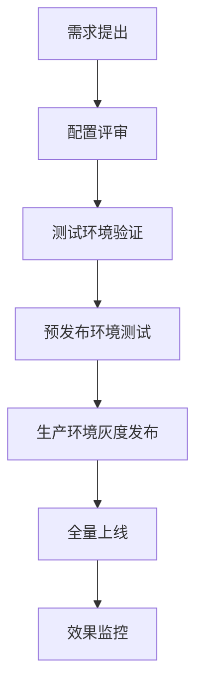

# Spring Cloud 配置中心与消息队列技术深度解析

## 一、Spring Cloud Config 核心技术详解

### 1.1 配置中心架构设计理念

#### 1.1.1 分层架构模式
```
┌─────────────────────────────────────────────────────────────┐
│                    Client Layer (客户端层)                   │
│  ┌─────────────┐  ┌─────────────┐  ┌─────────────┐         │
│  │ Config      │  │ Config      │  │ Config      │         │
│  │ Client A    │  │ Client B    │  │ Client C    │         │
│  └─────────────┘  └─────────────┘  └─────────────┘         │
└─────────────────────────▲───────────────────────────────────┘
                          │ HTTP/TCP协议通信
┌─────────────────────────▼───────────────────────────────────┐
│                 Server Layer (服务层)                        │
│                    Config Server                            │
│  ┌─────────────────────────────────────────────────────┐   │
│  │            Configuration Management                 │   │
│  │  ┌─────────┐  ┌─────────┐  ┌─────────┐  ┌────────┐ │   │
│  │  │ Git     │  │ Native  │  │ Vault   │  │ JDBC   │ │   │
│  │  │ Backend │  │ Files   │  │ Backend │  │Backend │ │   │
│  │  └─────────┘  └─────────┘  └─────────┘  └────────┘ │   │
│  └─────────────────────────────────────────────────────┘   │
└─────────────────────────────────────────────────────────────┘
```

#### 1.1.2 核心组件分析

##### Config Server 组件
```java
// 核心注解解析
@EnableConfigServer
├── @Import({ConfigServerConfiguration.class})
├── 启动配置服务器端点
├── 集成多种后端存储
└── 提供RESTful API接口

// 关键端点
GET /{application}/{profile}[/{label}]
GET /{application}-{profile}.yml
GET /{application}-{profile}.properties
```

##### Config Client 组件
```java
// 启动流程
1. Bootstrap阶段加载bootstrap.properties
2. 连接Config Server获取配置
3. 将配置注入Spring Environment
4. 应用程序正常启动

// 核心类
PropertySourceLocator - 配置定位器
ConfigServicePropertySourceLocator - 远程配置源定位器
```

### 1.2 配置加载机制深度解析

#### 1.2.1 加载优先级
```
命令行参数 > JNDI属性 > ServletConfig参数 > ServletContext参数
> 系统环境变量 > JVM系统属性 > 配置文件属性 > 默认属性
```

#### 1.2.2 Bootstrap上下文
```yaml
# Bootstrap配置加载顺序
bootstrap.properties/yml (最高优先级)
↓
application.properties/yml 
↓
远程配置服务器
↓
默认配置
```

#### 1.2.3 配置刷新机制
```java
@RefreshScope 注解工作原理:
1. 创建代理对象包装原始Bean
2. 监听EnvironmentChangeEvent事件
3. 收到刷新事件时重新创建Bean实例
4. 新实例使用更新后的配置值
```

## 二、Spring Cloud Bus 消息队列技术详解

### 2.1 消息总线架构

#### 2.1.1 系统拓扑结构
```
┌─────────────┐    ┌─────────────┐    ┌─────────────┐
│   Service   │    │   Service   │    │   Service   │
│     A       │    │     B       │    │     C       │
└──────┬──────┘    └──────┬──────┘    └──────┬──────┘
       │                  │                  │
       └──────────────────┼──────────────────┘
                          │
                   ┌──────▼──────┐
                   │  RabbitMQ   │  ← 消息代理
                   │   Broker    │
                   └──────▲──────┘
                          │
                   ┌──────▼──────┐
                   │ Config      │  ← 配置服务
                   │ Server      │
                   └─────────────┘
```

#### 2.1.2 核心组件关系
```java
Spring Cloud Bus 组件体系:
BusAutoConfiguration
├── BusProperties - 总线配置属性
├── ApplicationEventPublisher - 事件发布器
├── InboundMessageHandler - 入站消息处理器
└── OutboundMessageHandler - 出站消息处理器

RabbitMQ集成:
├── RabbitTemplate - 消息模板
├── SimpleMessageListenerContainer - 消息监听容器
└── Exchange/Queue绑定关系
```

### 2.2 消息传递机制

#### 2.2.1 消息路由策略
```java
// 默认目的地解析
destination = properties.getDestination() + ":" + serviceId + ":" + instanceIndex

// 广播模式
destination = properties.getDestination() + ":**"

// 点对点模式  
destination = properties.getDestination() + ":" + targetServiceId
```

#### 2.2.2 消息格式定义
```json
{
  "type": "RefreshRemoteApplicationEvent",
  "timestamp": 1234567890,
  "originService": "config-server:8888",
  "destinationService": "**",
  "id": "unique-event-id"
}
```

### 2.3 事件处理流程

#### 2.3.1 刷新事件传播
```sequence
用户操作->Config Server: POST /bus/refresh
Config Server->RabbitMQ: 发布Refresh事件
RabbitMQ->Config Client A: 广播消息
RabbitMQ->Config Client B: 广播消息
RabbitMQ->Config Client C: 广播消息
Config Client A->自身: 处理刷新事件
Config Client B->自身: 处理刷新事件
Config Client C->自身: 处理刷新事件
```

#### 2.3.2 事件监听器链
```java
@Configuration
public class RefreshEventListener {
    
    @EventListener
    public void handleRefresh(RemoteApplicationEvent event) {
        // 1. 验证事件类型
        if (event instanceof RefreshRemoteApplicationEvent) {
            // 2. 过滤目标服务
            if (shouldHandle(event)) {
                // 3. 触发本地刷新
                refreshScope.refreshAll();
            }
        }
    }
}
```

## 三、配置存储后端技术

### 3.1 Git后端实现

#### 3.1.1 存储结构设计
```
SpringcloudConfig/ (Git仓库根目录)
├── respo/                    # 配置文件目录
│   ├── config-client-dev.properties
│   ├── config-client-test.properties  
│   ├── config-client-prod.properties
│   └── application.properties
├── .git/
└── README.md
```

#### 3.1.2 文件命名规范
```properties
# 格式: {application}-{profile}.{extension}
config-client-dev.properties    # 开发环境配置
config-client-test.yml         # 测试环境YAML配置
application-common.yml         # 公共配置
```

#### 3.1.3 版本控制机制
```java
// Git操作核心类
JGitEnvironmentRepository
├── cloneRepository() - 克隆仓库
├── fetch() - 拉取最新变更
├── checkout() - 切换分支/标签
└── searchPaths() - 搜索配置路径

// 性能优化策略
- 本地缓存克隆副本
- 增量更新而非全量拉取
- 连接池管理Git操作
```

### 3.2 多后端支持

#### 3.2.1 后端适配器模式
```java
EnvironmentRepository (接口)
├── JGitEnvironmentRepository - Git后端
├── NativeEnvironmentRepository - 本地文件后端
├── VaultEnvironmentRepository - HashiCorp Vault后端
└── JdbcEnvironmentRepository - 数据库后端

// 配置切换示例
spring.profiles.active=native  # 使用本地文件
spring.profiles.active=vault   # 使用Vault
spring.profiles.active=jdbc    # 使用数据库
```

## 四、高可用与性能优化

### 4.1 配置缓存机制

#### 4.1.1 多级缓存设计
```java
@Configuration
public class ConfigCacheConfiguration {
    
    @Bean
    @Primary
    public EnvironmentRepository cachedEnvironmentRepository(
            EnvironmentRepository delegate) {
        return new CachingEnvironmentRepository(delegate);
    }
    
    // 缓存策略
    // L1: 本地内存缓存 (TTL: 60秒)
    // L2: Redis分布式缓存 (TTL: 300秒)
    // L3: Git仓库源数据
}
```

#### 4.1.2 缓存失效策略
```java
@Component
public class CacheInvalidationService {
    
    @EventListener
    public void handlePushEvent(GitPushEvent event) {
        // Git推送事件触发缓存失效
        cacheManager.evict(event.getChangedFiles());
        
        // 异步预热新配置
        asyncPreloadConfig(event.getBranch());
    }
}
```

### 4.2 集群部署方案

#### 4.2.1 负载均衡配置
```yaml
# Nginx负载均衡配置
upstream config-server {
    server config-server-1:8888 weight=1;
    server config-server-2:8888 weight=1;
    server config-server-3:8888 weight=1;
}

server {
    listen 80;
    location / {
        proxy_pass http://config-server;
        proxy_set_header Host $host;
        proxy_set_header X-Real-IP $remote_addr;
    }
}
```

#### 4.2.2 数据一致性保证
```java
@Service
public class ConfigConsistencyService {
    
    // 配置变更同步机制
    @EventListener
    public void syncConfigChange(ConfigChangeEvent event) {
        // 1. 写入主节点
        writeToMaster(event);
        
        // 2. 同步到从节点
        syncToSlaves(event);
        
        // 3. 确认一致性
        verifyConsistency(event);
    }
}
```

## 五、安全与监控

### 5.1 安全防护体系

#### 5.1.1 认证授权机制
```java
@Configuration
@EnableWebSecurity
public class SecurityConfig extends WebSecurityConfigurerAdapter {
    
    @Override
    protected void configure(HttpSecurity http) throws Exception {
        http
            .authorizeRequests()
                .antMatchers("/actuator/**").authenticated()
                .antMatchers("/bus/**").hasRole("ADMIN")
                .anyRequest().permitAll()
            .and()
            .httpBasic();
    }
}
```

#### 5.1.2 配置加密传输
```properties
# HTTPS配置
server.ssl.key-store=classpath:keystore.p12
server.ssl.key-store-password=password
server.ssl.keyStoreType=PKCS12
server.ssl.keyAlias=tomcat

# 敏感配置加密
encrypt.key=your-secret-key
```

### 5.2 监控告警体系

#### 5.2.1 健康检查端点
```java
@Component
public class ConfigHealthIndicator implements HealthIndicator {
    
    @Override
    public Health health() {
        try {
            // 检查Git连接状态
            boolean gitAccessible = checkGitConnection();
            
            // 检查配置加载状态
            boolean configLoaded = checkConfigLoading();
            
            if (gitAccessible && configLoaded) {
                return Health.up()
                    .withDetail("gitStatus", "accessible")
                    .withDetail("configStatus", "loaded")
                    .build();
            }
        } catch (Exception e) {
            return Health.down()
                .withDetail("error", e.getMessage())
                .build();
        }
    }
}
```

#### 5.2.2 性能指标收集
```java
@Component
public class ConfigMetricsCollector {
    
    private final MeterRegistry meterRegistry;
    
    @EventListener
    public void recordConfigAccess(ConfigAccessEvent event) {
        Timer.Sample sample = Timer.start(meterRegistry);
        
        // 记录配置访问延迟
        sample.stop(Timer.builder("config.access.latency")
            .tag("application", event.getApplication())
            .tag("profile", event.getProfile())
            .register(meterRegistry));
            
        // 记录配置访问次数
        Counter.builder("config.access.count")
            .tag("status", event.getStatus())
            .register(meterRegistry)
            .increment();
    }
}
```

## 六、生产环境最佳实践

### 6.1 部署架构建议

#### 6.1.1 推荐部署拓扑
```
┌─────────────────────────────────────────────────────────────┐
│                      Load Balancer                          │
│                    (Nginx/Haproxy)                          │
└─────────────┬─────────────────────────────┬─────────────────┘
              │                             │
    ┌─────────▼─────────┐       ┌───────────▼───────────┐
    │  Config Server    │       │   Config Server       │
    │     Cluster       │◄─────►│      Cluster          │
    │   (3+ instances)  │       │    (3+ instances)     │
    └─────────┬─────────┘       └───────────┬───────────┘
              │                             │
    ┌─────────▼─────────┐       ┌───────────▼───────────┐
    │      GitLab       │       │    Configuration      │
    │    Repository     │       │       Database        │
    │   (主备同步)      │       │     (可选备份)        │
    └───────────────────┘       └───────────────────────┘
```

### 6.2 运维管理规范

#### 6.2.1 配置变更流程


#### 6.2.2 应急响应机制
```java
@Component
public class EmergencyResponseService {
    
    // 紧急配置回滚
    public void rollbackConfiguration(String application, String version) {
        // 1. 停止配置刷新
        busProperties.setEnabled(false);
        
        // 2. 回滚到指定版本
        gitService.rollbackToVersion(version);
        
        // 3. 清除缓存
        cacheManager.clear();
        
        // 4. 重新启用配置刷新
        busProperties.setEnabled(true);
    }
}
```

通过以上深度技术分析，可以全面掌握Spring Cloud配置中心和消息队列的核心原理与最佳实践。